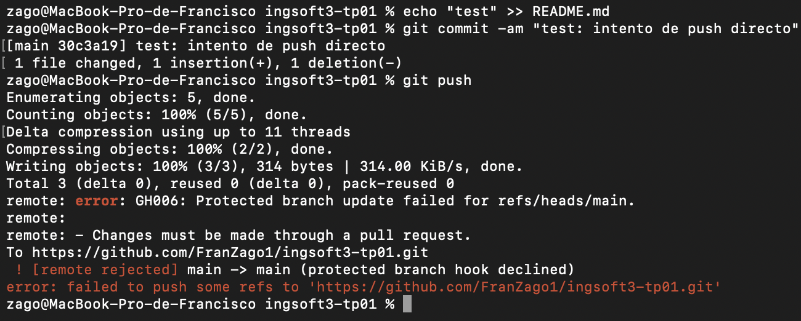
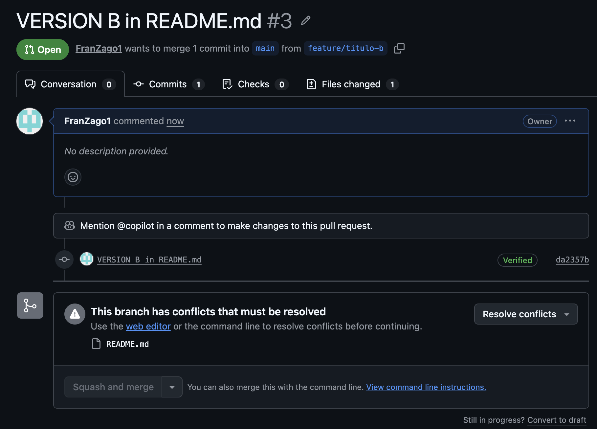
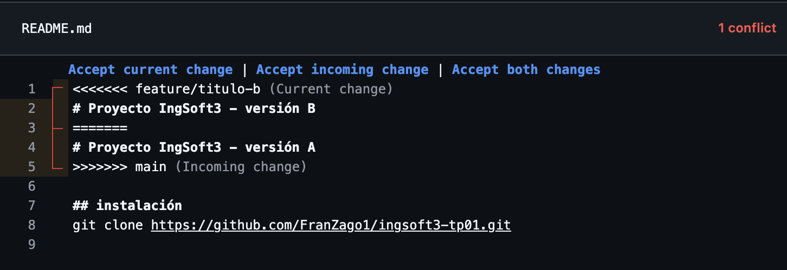
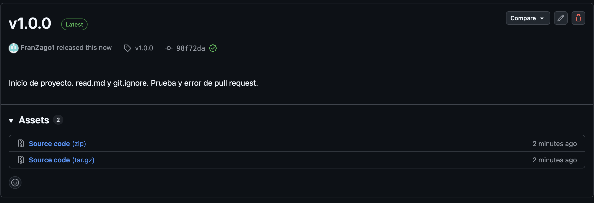

# Evidencias — Ingeniería de Software 3

Las pruebas de cada TP: capturas, salidas de terminal y lo que hay que mirar en
cada una. Documento único, una sección por TP.

---

## TP1 — Ramas protegidas, pull requests y conflictos

### 1. Push directo a main rechazado

La captura muestra el experimento completo en una sola sesión de terminal: primero se modifica README.md con un echo "test", después git commit -am "test: intento de push directo" crea el commit 30c3a19 sin problema —Git local no sabe nada de reglas de GitHub— y recién en el git push aparece el conflicto.

Vale la pena leer el orden de los mensajes. Todo lo que va de Enumerating objects hasta Writing objects: 100% (3/3), 314 bytes es trabajo que sí se completó: la autenticación pasó, los permisos de escritura existen, los objetos llegaron al servidor. El freno viene después, cuando GitHub evalúa la política de la rama antes de mover la referencia:

remote: error: GH006: Protected branch update failed for refs/heads/main.
remote: - Changes must be made through a pull request.
 ! [remote rejected] main -> main (protected branch hook declined)

Es decir: no falló el push por falta de acceso, falló porque main tiene una regla que exige pull request, y esa regla se aplica incluso al dueño del repositorio, que es quien está empujando. Eso es exactamente lo que se buscaba al activar Do not allow bypassing the above settings: si el administrador pudiera pasar por arriba, la protección sería decorativa.

El commit rechazado quedó solo en la máquina local; se limpió con git reset --hard HEAD~1 y el remoto nunca lo vio.

### 2. El PR de la rama B no se puede mergear: conflicto



PR #2 (feature/titulo-a). En la interfaz aparecen el indicador rojo Merge conflicts en la esquina superior derecha, el aviso This branch has conflicts that must be resolved señalando a README.md como el único archivo en disputa, y el botón Squash and merge bloqueado.

Lo interesante está en la secuencia temporal: apenas un minuto antes, GitHub marcaba este mismo PR como mergeable. Ambas ramas partieron del mismo commit de main y tocaron la misma línea, pero mientras ninguna de las dos había sido incorporada, no existía colisión alguna. El conflicto no aparece en el momento de escribir el cambio: aparece recién cuando se lo quiere integrar contra un main que ya avanzó.

### 3. Los marcadores del conflicto



Arriba de ======= está la versión de la rama actual (feature/titulo-b); abajo, la que ya vive en main tras el merge del PR #2. Sobre el bloque, GitHub ofrece los tres atajos de siempre —Accept current change | Accept incoming change | Accept both changes— y en la esquina superior derecha se lee 1 conflict en rojo: mientras quede un solo marcador en el archivo, no hay forma de darlo por resuelto.

Y lo que no está en conflicto es igual de informativo: las líneas 6 a 8 —la sección ## instalación con el git clone, que venía del PR #1— aparecen limpias, fuera del bloque marcado. Ninguna de las dos ramas las tocó, así que Git las fusionó solo, sin preguntar. El conflicto es quirúrgico: cae sobre la línea disputada, no sobre el archivo entero.

### 4. La release v1.0.0 publicada



Release v1.0.0 con el badge Latest, apuntando al tag v1.0.0 y al commit 98f72da — la punta de main después de mergear los tres PRs. Las notas dicen qué incluye la versión escritas para que las lea una persona, e incluyen la justificación de por qué el número es 1.0.0 y no 0.1.0.

El tag se creó anotado desde la máquina (git tag -a v1.0.0 -m "..." + git push origin v1.0.0) y la release se publicó sobre ese tag ya existente. Un tag anotado es un objeto de Git con autor, fecha y mensaje propios; un tag liviano sería solo un puntero sin metadatos. Para marcar una entrega, el anotado es el que corresponde.

### 5. El `README.md` del ejercicio de conflicto

Desde el TP2 el `README.md` de la raíz documenta la aplicación. El archivo tal como
quedó al cerrar el TP1 —o sea, el resultado de haber resuelto el conflicto eligiendo
la "versión A", más la sección `## instalación` que Git fusionó sola porque ninguna
de las dos ramas la tocó— era este, y se conserva acá:

```markdown
# Proyecto IngSoft3 - versión A

## instalación
git clone https://github.com/FranZago1/ingsoft3-tp01.git
```

El historial lo respalda: `58c95ca` (PR #2) dejó el título en "versión A" y `98f72da`
(PR #3) es el merge donde se resolvió el conflicto a mano. La captura del punto 3
muestra ese mismo archivo con los marcadores todavía puestos.
